# XNINETZY LABS — Low-Fidelity Wireframes

> **Status**: Reference for visual structure & section order (NOT styling)
> **Date**: 2026-09-10
> **Convention**: All pages are Mermaid `flowchart TD`. Each node = one section/block. `[lo-fi]` markers = placeholder visuals.
> **Companion docs**: `docs/superpowers/specs/2026-09-10-xninetzy-labs-platform-design.md` · `docs/superpowers/plans/2026-09-10-xninetzy-labs-platform-plan.md`

---

## 1. Homepage `/`

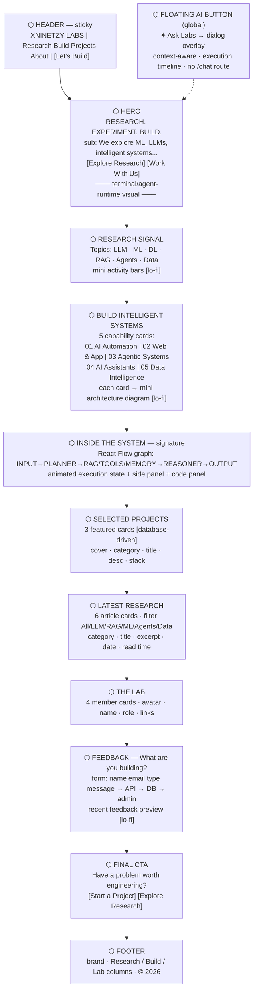

---

## 2. Research Listing `/research`

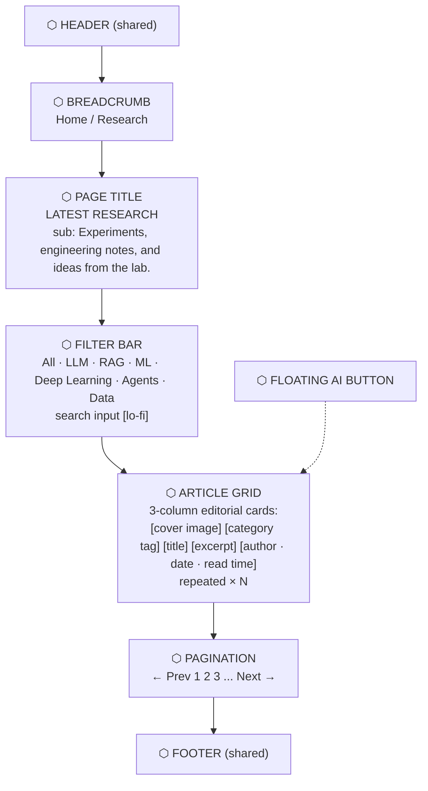

---

## 3. Article Detail `/research/[slug]`

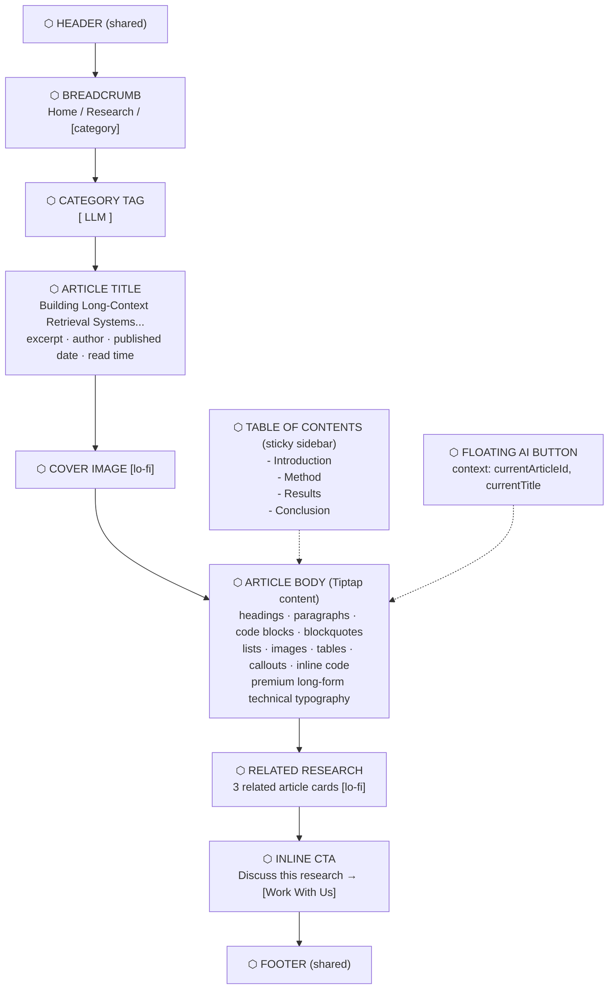

---

## 4. Projects Listing `/projects`

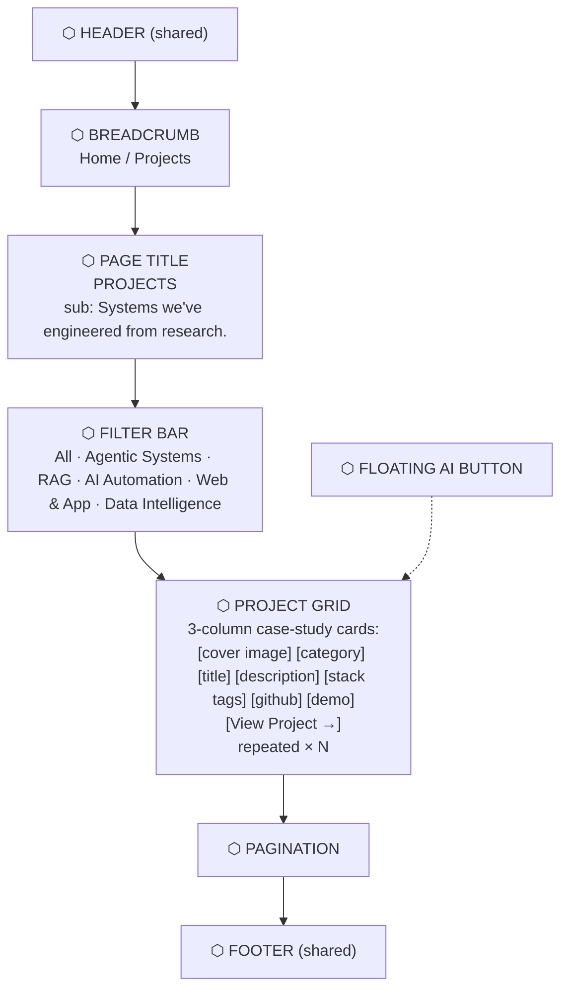

---

## 5. Project Detail `/projects/[slug]`

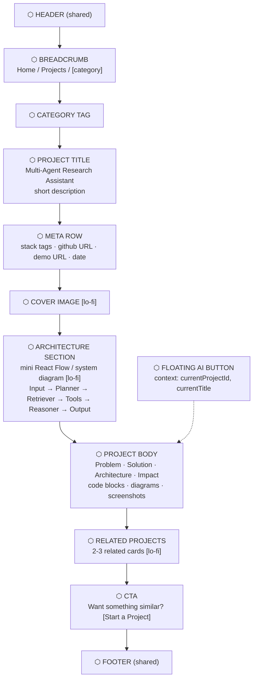

---

## 6. About `/about`

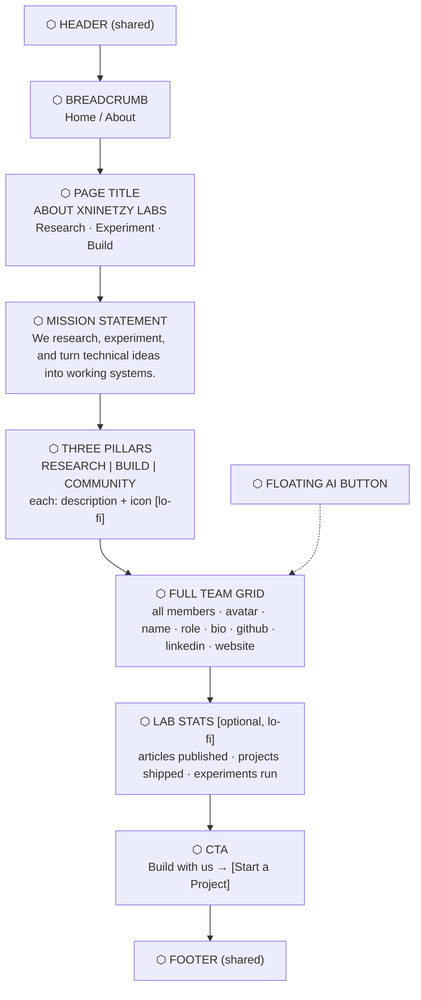

---

## 7. Admin Dashboard `/admin`

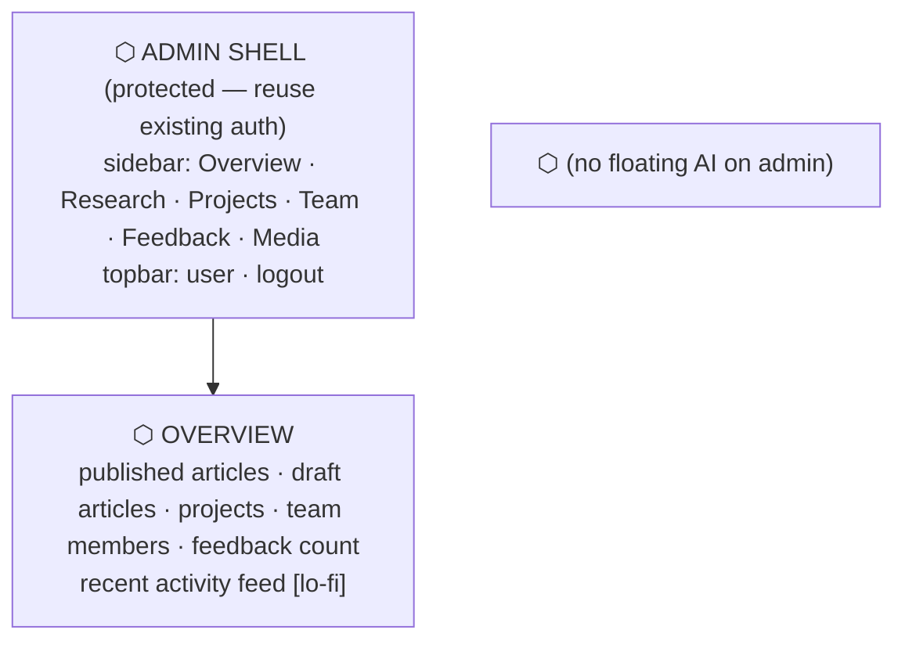

---

## 8. Admin — Articles `/admin/articles`

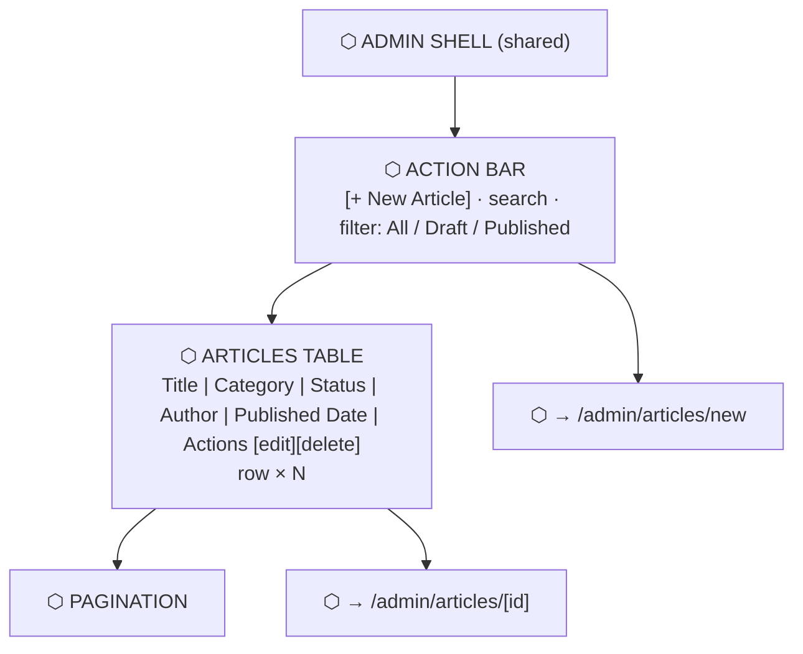

---

## 9. Admin — Article Editor `/admin/articles/new` & `/admin/articles/[id]`

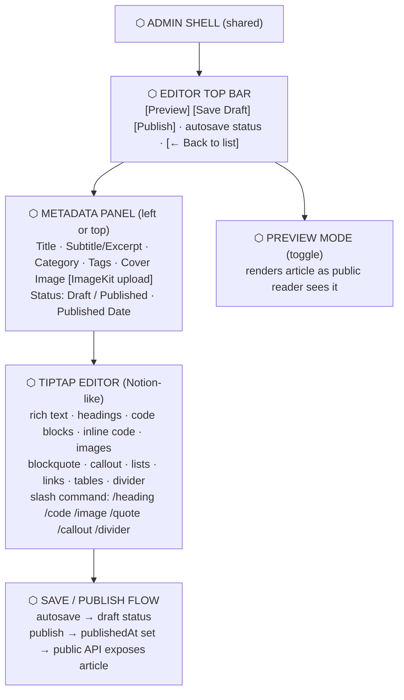

---

## 10. Admin — Projects `/admin/projects`

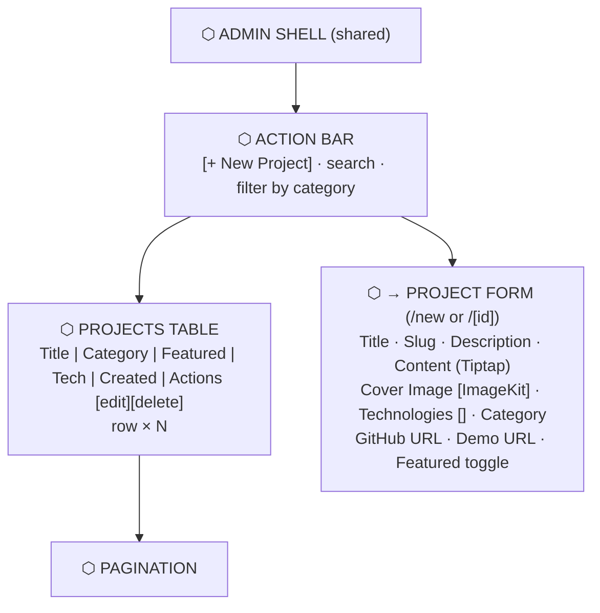

---

## 11. Admin — Team `/admin/team`

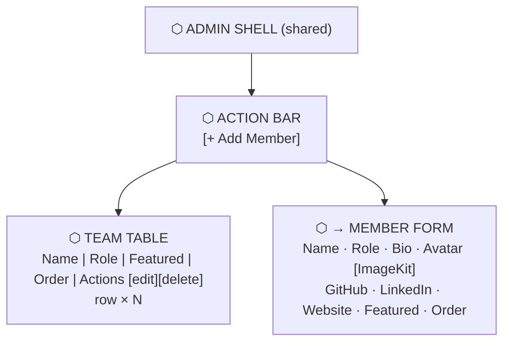

---

## 12. Admin — Feedback `/admin/feedback`

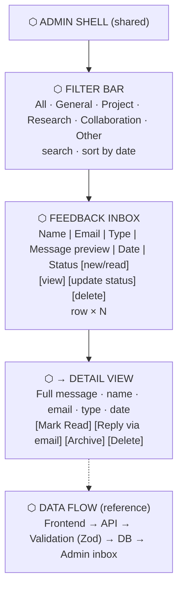

---

## 13. Floating AI Dialog (global — semua halaman public)

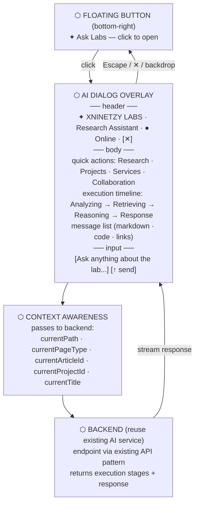

---

## 14. Route Map — Public vs Admin

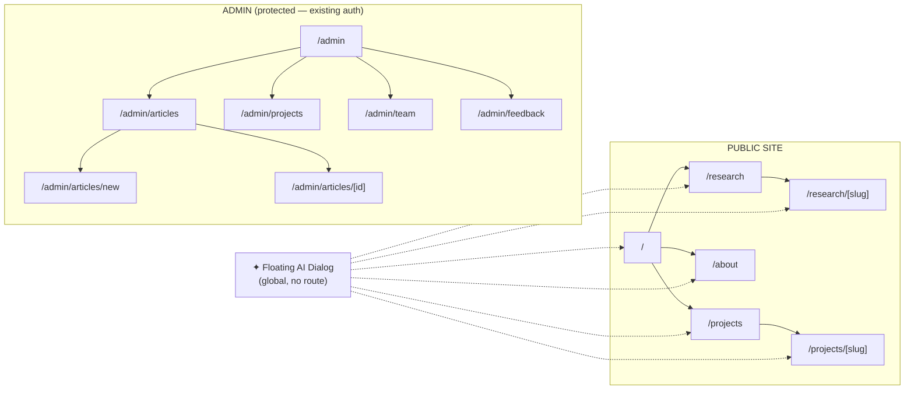

---

## 15. Brand Architecture (referensi struktur)

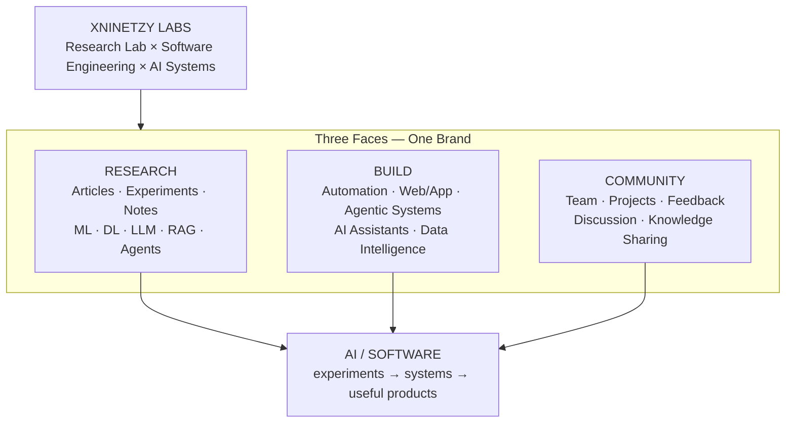
